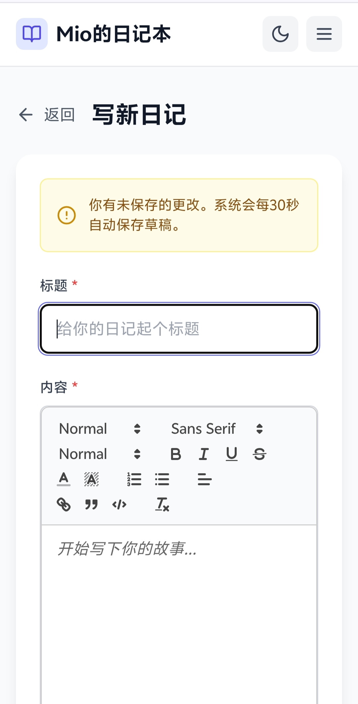

# GitHub 发布说明

## 项目信息

**Mio的日记本** - 一个功能完整的个人日记应用，支持富文本编辑、图片上传、心情追踪、标签管理、个人主页等功能。

## 技术栈

### 后端
- Node.js 18+
- Express 4.21.2
- Prisma 6.2.1 ORM
- SQLite 3 数据库
- JWT 9.0.2 认证
- Sharp 0.34.5 图片处理
- Multer 2.0.0-rc.4 文件上传

### 前端
- React 18.3.1
- Vite 6.0.3
- Tailwind CSS 3.4.17
- React Router 7.1.1
- React Quill 2.0.0-beta.4 (富文本编辑)
- Quill 2.0.3 编辑器核心
- React Image Crop 11.0.10 图片裁剪

## 功能特性

### 用户功能
- ✅ 用户注册与登录（JWT 双令牌认证）
- ✅ 个人主页（公开访问）
- ✅ 用户资料管理（头像、背景图、个人签名）
- ✅ 日记可见性设置（公开/私密）
- ✅ 修改密码
- ✅ Token 自动刷新

### 日记功能
- ✅ 日记 CRUD 操作
- ✅ 富文本编辑器（Quill 2.0.3）
- ✅ 图片上传（多图片，最大5MB）
- ✅ 心情追踪（7种预设情绪）
- ✅ 标签系统（最多10个标签）
- ✅ 日记搜索与筛选
- ✅ 自动保存草稿

### 仪表盘
- ✅ 日记统计（总数、本月新增、本周新增）
- ✅ 情绪分布统计
- ✅ 热门标签统计
- ✅ 最近日记列表

### 系统功能
- ✅ 响应式设计（完美适配移动端）
- ✅ 暗黑模式支持
- ✅ 二次元风格功能展示页
- ✅ 一键安装脚本（含 JWT 密钥自动生成）

## 快速开始

### 一键安装（推荐）

```bash
# 克隆项目
git clone https://github.com/zlyawa/mio-diary.git
cd mio-diary

# 运行一键安装脚本
bash install.sh
```

### 手动安装

```bash
# 安装后端
cd backend
npm install
npx prisma generate
npx prisma migrate dev
npm start

# 安装前端（新终端）
cd frontend
npm install --legacy-peer-deps
npm run dev
```

## 截图预览





> **版权声明**：部分预览图中的图片及表情包来源于网络、B站等平台。本项目仅供学习交流使用，所有内容完全公开开源，不用于商业用途。

## 访问地址

- 前端：http://localhost:5173
- 后端API：http://localhost:3001/api

## 贡献指南

欢迎提交 Issue 和 Pull Request！

## 许可证

ISC License

## 联系方式

- GitHub: https://github.com/zlyawa/mio-diary
- Issues: https://github.com/zlyawa/mio-diary/issues