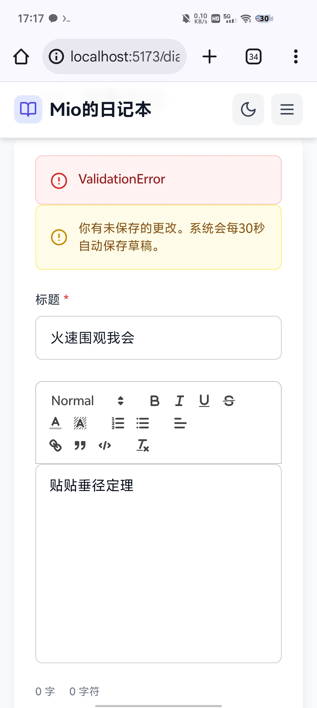

# GitHub 发布说明

## 项目信息

**Mio的日记本** - 一个功能完整的个人日记应用，支持富文本编辑、图片上传、心情追踪、标签管理等功能。

## 技术栈

### 后端
- Node.js 18+
- Express 4.x
- Prisma ORM
- SQLite 数据库
- JWT 认证

### 前端
- React 19
- Vite 6.x
- Tailwind CSS
- React Router 7.x
- React Quill (富文本编辑)

## 功能特性

- ✅ 用户注册与登录（JWT 双令牌认证）
- ✅ 日记 CRUD 操作
- ✅ 富文本编辑器
- ✅ 图片上传与管理
- ✅ 心情追踪（7种预设情绪）
- ✅ 标签系统
- ✅ 仪表盘统计
- ✅ 日记搜索与筛选
- ✅ 个人主页
- ✅ 用户资料管理（头像、背景图、签名）
- ✅ 响应式设计
- ✅ 暗黑模式支持
- ✅ 自动保存草稿

## 快速开始

```bash
# 使用一键脚本
bash install.sh

# 或手动安装
cd backend && npm install
cd frontend && npm install
cd backend && npm start
cd frontend && npm run dev
```

## 截图



## 在线演示

- 前端：http://localhost:5173
- 后端API：http://localhost:3001/api

## 贡献指南

欢迎提交 Issue 和 Pull Request！

## 许可证

MIT License

## 联系方式

- GitHub: https://github.com/your-username/mio-diary-project
- Issues: https://github.com/your-username/mio-diary-project/issues