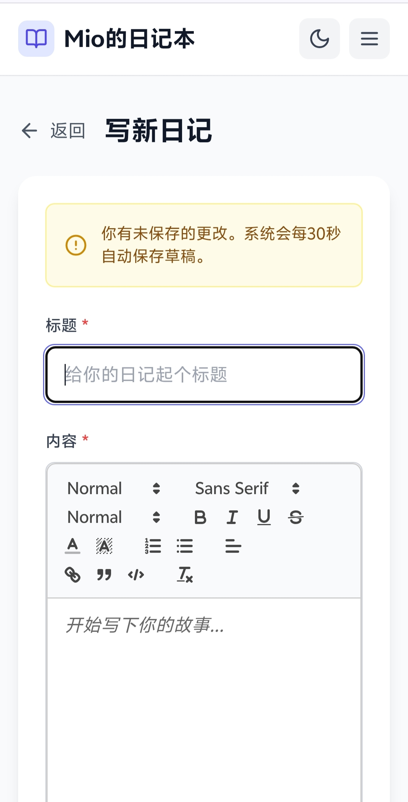

# Mio的日记本

<div align="center">


**一个简洁优雅的个人日记管理系统，支持富文本编辑、AI智能审核、评论互动、点赞收藏等功能**

[快速开始](#快速开始) • [功能特性](#功能特性) • [技术栈](#技术栈)

</div>

---

## 项目简介

Mio的日记本是一个现代化的全栈个人日记应用，采用前后端分离架构。支持富文本编辑、图片上传、情绪追踪、分类管理、评论互动、写作统计等功能，并内置 AI 智能审核系统。

---

## 快速开始

### 环境要求

| 组件 | 版本 | 说明 |
|------|------|------|
| Node.js | 18+ | 必须 |
| Redis | 6+ | 必须 |

### 安装与启动

```bash
# 克隆项目
git clone https://github.com/zlyawa/mio-diary.git
cd mio-diary

# 安装并启动（自动安装依赖、初始化数据库）
./mio.sh install
./mio.sh start-log
```

访问 `http://localhost:5173` 即可使用，第一个注册的用户自动成为**管理员**。

### 管理命令

| 命令 | 说明 |
|------|------|
| `./mio.sh install` | 安装依赖、初始化数据库 |
| `./mio.sh start` | 启动服务 |
| `./mio.sh start-log` | 启动并显示日志 |
| `./mio.sh stop` | 停止服务 |
| `./mio.sh restart` | 重启服务 |
| `./mio.sh status` | 查看状态 |
| `./mio.sh log` | 查看实时日志 |
| `./mio.sh build` | 构建生产版本 |
| `./mio.sh db-studio` | 打开数据库管理界面 |
| `./mio.sh db-migrate` | 执行数据库迁移 |
| `./mio.sh db-backup` | 备份数据库 |

---

## 功能特性

### 用户功能

- **日记管理** — 富文本编辑、图片上传、情绪标签、分类管理
- **互动系统** — 评论（支持回复、图片）、点赞、收藏夹
- **写作统计** — 热力图、心情趋势、词云、写作习惯分析
- **个人主页** — 瀑布流展示、响应式布局
- **暗黑模式** — 跟随系统或手动切换
- **通知中心** — 审核结果、评论回复、点赞通知

### 管理员功能

- **仪表盘** — 用户统计、日记数量、待审核数量
- **用户管理** — 查看用户、封禁用户、重置密码
- **内容审核** — 日记审核、评论审核
- **AI 审核** — 智谱 AI 驱动的自动内容审核
- **系统设置** — 功能开关、SMTP 配置、网站自定义

### 功能开关

| 开关 | 说明 | 默认 |
|------|------|------|
| 允许注册 | 是否允许新用户注册 | ✅ |
| 日记审核 | 日记需管理员审核才能发布 | ❌ |
| 评论审核 | 评论需审核才能发布 | ❌ |
| AI 审核 | 使用 AI 自动审核评论内容 | ❌ |
| 点赞/评论/收藏/分享/统计 | 各功能模块开关 | 部分开启 |

---

## 技术栈

| 层级 | 技术 |
|------|------|
| 前端 | React 18 + Vite 6 + Tailwind CSS |
| 后端 | Node.js + Express + Prisma |
| 数据库 | SQLite |
| 缓存 | Redis（必需） |
| 认证 | JWT 双令牌 |
| AI 审核 | 智谱 AI |

---

## 项目结构

```
mio-diary/
├── backend/           # 后端服务
│   ├── prisma/        # 数据库模型和迁移
│   ├── src/           # 源码（controllers、routes、services 等）
│   └── uploads/       # 上传文件
├── frontend/          # 前端应用
│   ├── src/           # 源码（components、pages、context 等）
│   └── public/        # 静态资源
├── mio.sh             # Linux 管理脚本
└── mio.bat            # Windows 管理脚本
```

---

## 常见问题

**Q: 依赖安装失败？**
```bash
rm -rf node_modules package-lock.json
npm install --legacy-peer-deps
```

**Q: 端口被占用？**
```bash
lsof -i :3001  # 后端端口
lsof -i :5173  # 前端端口
kill -9 <PID>
```

**Q: Redis 连接失败？**
```bash
redis-cli ping    # 检查 Redis 状态
./mio.sh restart  # 重启服务
```

**Q: 忘记管理员密码？**
```bash
cd backend && npx prisma studio
# 在 User 表中找到用户，将 role 改为 admin
```

---

## 手机端预览

<div align="center">

| | | |
|:---:|:---:|:---:|
||||
||||

</div>

---

## 许可证

ISC License

<div align="center">

**Made with ❤️ by zlyawa**

[GitHub](https://github.com/zlyawa/mio-diary) • [Issues](https://github.com/zlyawa/mio-diary/issues)

</div>
